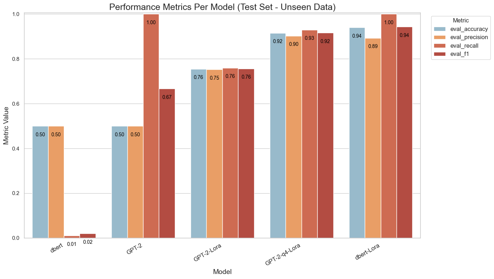

# Lightweight Fine-Tuning of Foundation Models

This project demonstrates parameter-efficient fine-tuning techniques for foundation models on a text classification task using consumer financial complaints data. The project explores different approaches to make fine-tuning more efficient in terms of computational resources and memory usage while maintaining good performance.

## Project Overview

The project fine-tunes pre-trained language models (DistilBERT and GPT-2) on a binary classification task using Parameter-Efficient Fine-Tuning (PEFT) techniques, specifically Low-Rank Adaptation (LoRA). It also explores quantization to further reduce the memory footprint of models.

### Task

Binary classification of consumer complaints into two categories:
- Credit Card or Prepaid Card complaints
- Mortgage complaints

### Dataset

The dataset used is the **Consumer Financial Complaints** dataset from Hugging Face (`BEE-spoke-data/consumer-finance-complaints`), which contains customer complaints filed with the Consumer Financial Protection Bureau (CFPB).

For this project, the dataset was filtered to include:
- Only complaints related to **Bank of America, National Association**
- Only complaints about **Credit Card or Prepaid Card** and **Mortgage** products
- Only complaints with non-null narrative text

The filtered dataset consists of:
- 2,000 training samples (1,000 per class)
- 200 test samples (100 per class)

## Technology Stack

- **Deep Learning Framework**: PyTorch (with CUDA support)
- **NLP Libraries**: 
  - Hugging Face Transformers
  - PEFT (Parameter-Efficient Fine-Tuning)
  - BitsAndBytes (for quantization)
- **Data Processing**: 
  - Pandas
  - Hugging Face Datasets
- **Evaluation**: 
  - Scikit-learn
  - Evaluate
- **Visualization**: 
  - Matplotlib
  - Seaborn

## Models and Techniques

### Foundation Models

1. **DistilBERT** (`distilbert-base-uncased`): A distilled version of BERT that is smaller and faster while retaining good performance.
2. **GPT-2** (`gpt2`): A transformer-based language model developed by OpenAI.

### Fine-Tuning Techniques

1. **LoRA (Low-Rank Adaptation)**: A parameter-efficient fine-tuning technique that adds trainable low-rank matrices to transformer layers, significantly reducing the number of trainable parameters.
2. **Quantization**: Reducing the precision of model weights (to 4-bit) to decrease memory usage and potentially speed up inference.

## Project Structure and Notebooks

### 1. Data Preparation

- **data.ipynb**: Loads the original dataset, applies filtering criteria, balances the classes, and saves the processed training dataset.
- **test_data.ipynb**: Creates a separate test dataset with no overlap with the training data, ensuring proper evaluation on unseen data.

### 2. Model Fine-Tuning

- **distibert_lora.ipynb**: Fine-tunes DistilBERT using LoRA for the classification task.
- **gpt2_lora.ipynb**: Fine-tunes GPT-2 using LoRA for the classification task.
- **gpt2_quanti_lora.ipynb**: Fine-tunes a quantized (4-bit) version of GPT-2 using LoRA (QLora).

### 3. Model Comparison

- **comparing_models.ipynb**: Evaluates and compares all models on the test dataset, computing metrics like accuracy, precision, recall, and F1-score.

## Results

After fine-tuning and validating the models, they were deployed to predict 200 complaints (test set - unseen data).

Performance metrics for all models:



## How to Use This Project

### Reading Order

For the best understanding of the project, read the notebooks in the following order:

1. **data.ipynb**: Understand the dataset and preprocessing steps
2. **test_data.ipynb**: See how the test dataset was created
3. **distibert_lora.ipynb**: Learn about LoRA fine-tuning with DistilBERT
4. **gpt2_lora.ipynb**: Explore LoRA fine-tuning with GPT-2
5. **gpt2_quanti_lora.ipynb**: Understand quantization combined with LoRA
6. **comparing_models.ipynb**: Review the comparison of all models

### Running the Project

1. Install the required dependencies:
   ```
   pip install -r requirements.txt
   ```

2. Execute the notebooks in the order mentioned above.

3. For GPU acceleration, ensure you have a CUDA-compatible GPU and the appropriate CUDA toolkit installed.

## Potential Applications

The fine-tuned models can be used for:
- Automated classification of customer complaints
- Routing complaints to appropriate departments
- Identifying trends in customer issues
- Building more complex NLP systems for financial text analysis

## Conclusion

This project demonstrates that lightweight fine-tuning techniques like LoRA and quantization can effectively adapt foundation models to specific tasks with minimal computational resources while maintaining good performance. These approaches make fine-tuning more accessible and environmentally friendly compared to full fine-tuning of large language models.
